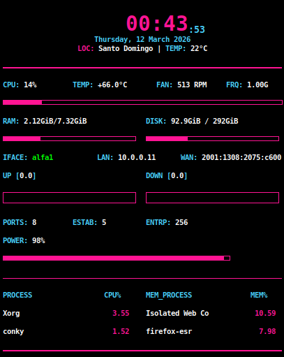

# NEON OPERATOR CONKY

Cyberpunk styled Conky system monitor.

Features:
- CPU / RAM / Disk
- Network speed
- Public IP
- Weather
- Security metrics
- Top processes

Compatible with most Linux systems.

Note:
Network interface may need adjustment depending on system
(e.g. wlan0, wlan1, eth0, enp3s0).

## Preview

## Install

# Clone the repository

git clone https://github.com/wilsontavarez/neon-operator-conky

cd neon-operator-conky

# Copy the configuration file

cp neon-operator.conky ~/.conkyrc

# Install Conky and required dependencies

sudo apt update

sudo apt install conky-all lm-sensors curl -y

# Automatically detect hardware sensors (only needed once)

sudo sensors-detect --auto

# Enable Conky autostart so it runs every time you log in

mkdir -p ~/.config/autostart

printf '[Desktop Entry]\nType=Application\nExec=conky\nHidden=false\nNoDisplay=false\nX-GNOME-Autostart-enabled=true\nName=Conky\nComment=Start Conky system monitor\n' > ~/.config/autostart/conky.desktop

# Start Conky now

conky &

# RESULT

- Conky starts automatically after every reboot or login.
- Hardware sensors are detected automatically.
- Works on Debian, Ubuntu, antiX and most Linux desktops.

# TROUBLESHOOTING

If network speed does not appear, edit the network interface inside ~/.conkyrc
Example:
wlan0
eth0
enp3s0
